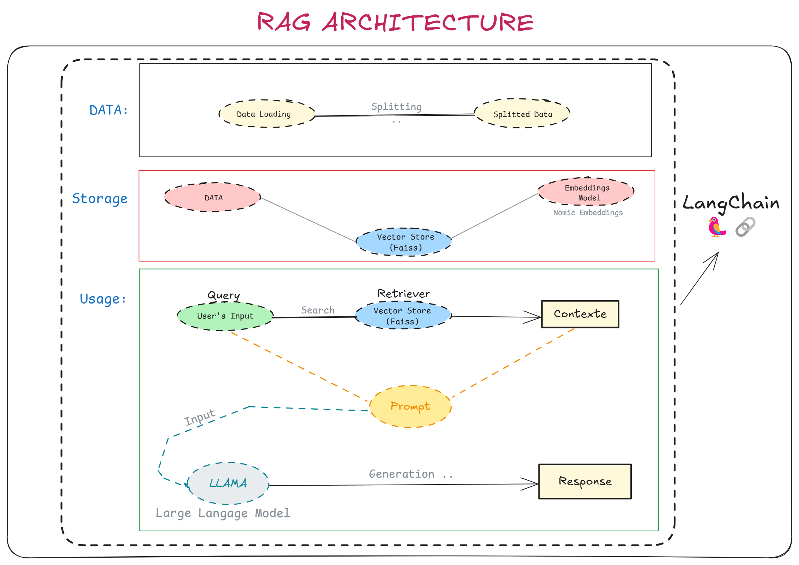
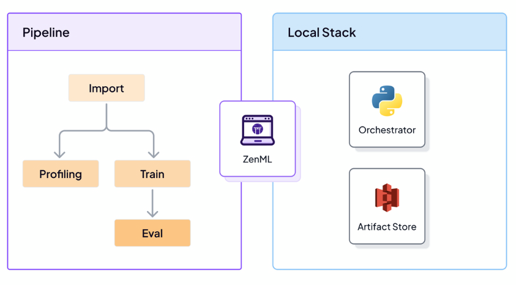
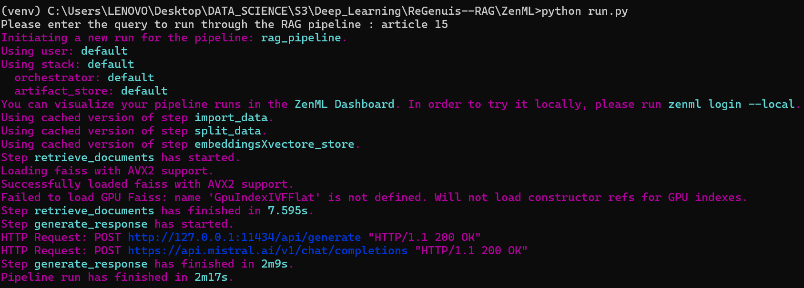
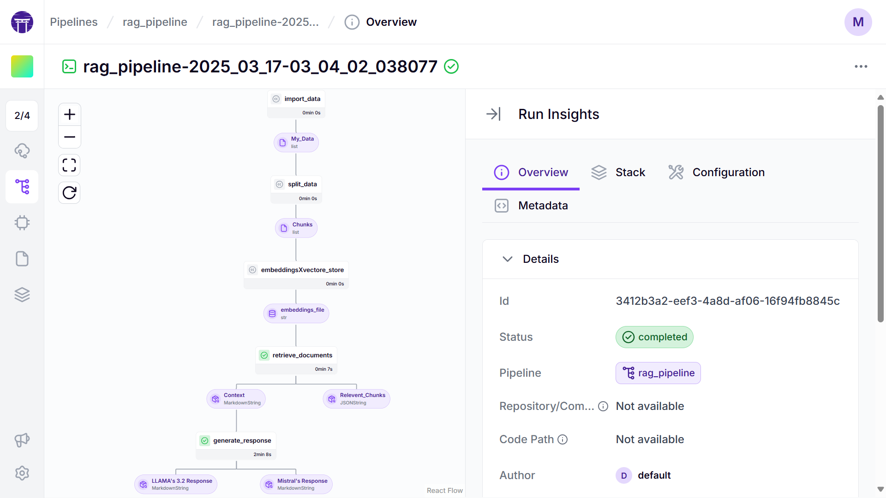

# 🧠 ReGenius : RAG system with LangChain 🦜 and ZenML frameworks
## 📝 Overview
ReGenius is a **RAG** (Retrieval Augmentation Generation) based approach aimed at providing responses to users's inputs on personal data (pdf format). The system laverages **ZenML** as a tool to manage the data pipeline, structure and orchestrate the workflow.
## 🚀 Key Features 
### 📍 RAG architecture
* 📄 Ingest PDFs **(Data Loading)**
* ✂️ **Data Splitting**
* 🔢 **Embeddings Model** Converts splitted data into numeric representation (vectors) such as nomic
* 🔍 **Vectore Store**  Stores and retrieves data efficiently (e.g., FAISS, ChromaDB).
* 🤖 Generate responses using a **powerful LLM** (e.g., LLaMA, GPT, Mistral).


### 📍 ZenML
**- ZenML** is an open-source **MLOps framework** that helps you build, deploy, and manage machine learning pipelines in a structured and reproducible way.
* #### **🔗Key Components :**
**- Steps** : Steps are simple python functions annotated with the **@step** decorator.

**- Pipelines** : At its core, ZenML follows a pipeline-based workflow for your projects. A pipeline consists of a series of steps, organized in any order that makes sense for your use cas. 

**-->** Even though pipelines are simple Python functions, you are only allowed to call steps within this function  
**-->** Executing the Pipeline is as easy as calling the function that you decorated with the **@pipeline** decorator.

**- Artifacts :** Artifacts represent the data that goes through your steps as inputs and outputs and they are automatically tracked and stored by ZenML


**- Stacks :** When you want to execute a pipeline run with ZenML, Stacks come into play. A Stack is a collection of stack components.  
**-->** For instance, if you take a close look at the **default local stack of ZenML**, you will see two components that are required in every stack in ZenML, namely an orchestrator and an artifact store, which are the ones used in this project.


**- Orchestrator :** An Orchestrator is a workhorse that coordinates all the steps to run in a pipeline. It decides what steps to run and when to run them.

**- Artifact Store :** Stores Artifacts

## Getting Started ✅ 
**1. Clone the repository**
```bash
git clone https://github.com/Marouansw/ReGenius--RAG.git
```
**2. Navigate to the Project Directory**
   ```bash
   cd ReGenius--RAG
   ```
**3. Create a Virtual Environment**
   ```bash
   python -m venv env
   ```

**4. Activate the Virtual Environment**
   - On Windows:
     ```bash
     env\Scripts\activate
     ```
   - On macOS/Linux:
     ```bash
     source env/bin/activate
     ```

**5. Install the Required Dependencies**
   ```bash
   pip install -r requirements.txt
   ```
   * Now that you installed ZenML , you can  lunch the **local server**
   ```bash
  zenml login --local  # opens the dashboard locally 
   ```
* Or, if you would like to run the ZenML server with Docker instead :
```bash
  docker run -it -d -p 8080:8080 zenmldocker/zenml-server
```

**6.** Open an other terminal, cd to project directory and activate the environment again then **cd to ZenML folder**
```bash
   cd ZenML
   ```
**7. Execute run.py**
   ```bash
python run.py  
 ```


**--> See the orchestration of the pipeline withing your local stack at the dashboard we lunched earlier**



